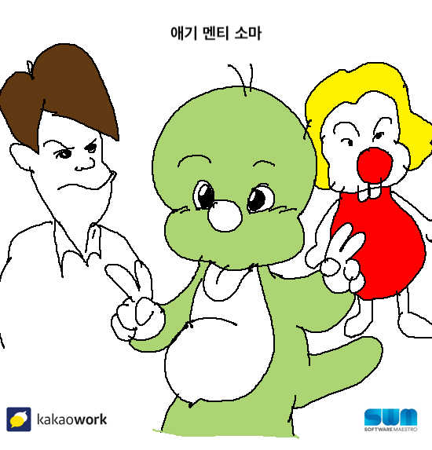
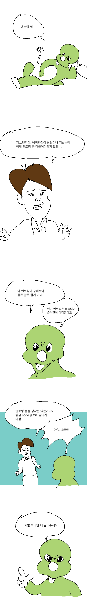
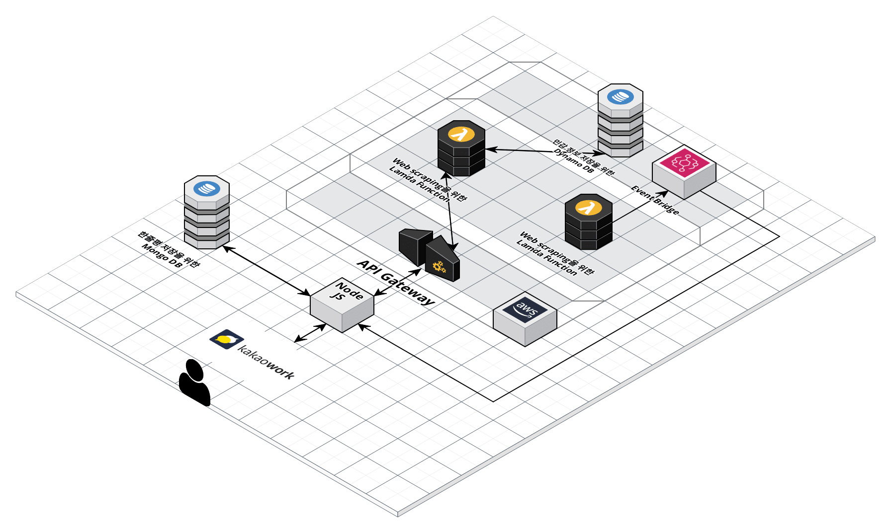

# Team[-2] - SW마에스트로 미니프로젝트 29팀 
## 프로젝트 소개
<p align="center">
<br>
실시간으로 올라오는 멘토링 신청과 각 멘토링이 어떨지 고민되는 <span style="color: blue;"><strong>소마인</strong></span>을 위해서<br> 멘토링 신청/취소와 멘토링 한줄평 기능을 제공하는 <strong>챗봇 애기 멘티 소마!</strong>
</p>


## 프로젝트 기획 동기 
<p align="center">

</p>

## 연수생 인터뷰


## 주요기능 설명

### 멘토링 신청 및 취소
  + 소프트웨어 마에스트로 홈페이지에서 멘토링이 등록되면 해당 멘토링에 정보가 담긴 알림이 전송됩니다.
  + 해당 알림을 통해 웰컴메시지에서 계정등록 버튼을 통해 등록된 계정을 통해 멘토링을 신청/취소할 수 있습니다.
  + 계정정보는 팀원들도 열람이 불가한 독립된 dynamo DB에 저장됩니다.
  + (멘토링을 신청하고 실제로 신청된 사진)
### 멘토링 후기 및 한줄평
  + 소프트웨어 마에스트로 홈페이지의 멘토링 신청자 정보를 기반으로 전날 멘토링을 들은 수강생들에게 한줄평 요청 메시지를 전송합니다
  + 저장된 한줄평은 웰컴메시지의 한줄평 조회 버튼을 통해 열람할 수 있습니다.
  + (구동 예시)

## 아키텍쳐 구조

------------

## 디렉터리 구조
```
├── README.md
├── app.js
├── controllers
│   ├── account.js
│   ├── mentoring.js
│   ├── mongodb.js
│   ├── notification.js
│   └── review.js
├── libs
│   └── kakaoWork
│       └── index.js
├── models
│   └── review.js
├── msgGenerator
│   ├── accountModal.msg.js
│   ├── accountSucess.msg.js
│   ├── applicantSucess.msg.js
│   ├── keywordComplete.msg.js
│   ├── keywordModal.msg.js
│   ├── mentoring.msg.js
│   ├── review
│   │   ├── reviewAsk.msg.js
│   │   ├── reviewFailed.msg.js
│   │   ├── reviewResultBlock.msg.js
│   │   ├── reviewSearchModal.msg.js
│   │   ├── reviewSearchResult.msg.js
│   │   ├── reviewSuccess.msg.js
│   │   └── reviewWriteModal.msg.js
│   └── welcome.msg.js
├── package-lock.json
├── package.json
└──  routes
    ├── alert.js
    ├── callback.js
    ├── db.js
    ├── index.js
    ├── request.js
    └── review.js

```


## Team[-2] 구성원
임동진, 이원기, 이선노, 함초롬, 김호준, 유한길

## 건의 사항 및 버그 리포팅 하러 가기
https://forms.gle/6NiahMw3tf8WfK2i7

## API문서
[깃허브 위키 바로가기](https://github.com/swmTeam-29/main-container/wiki)

[노션 페이지 ](https://www.notion.so/team-2-5f94d97c35d94bf39a4cad509ca02c02)

