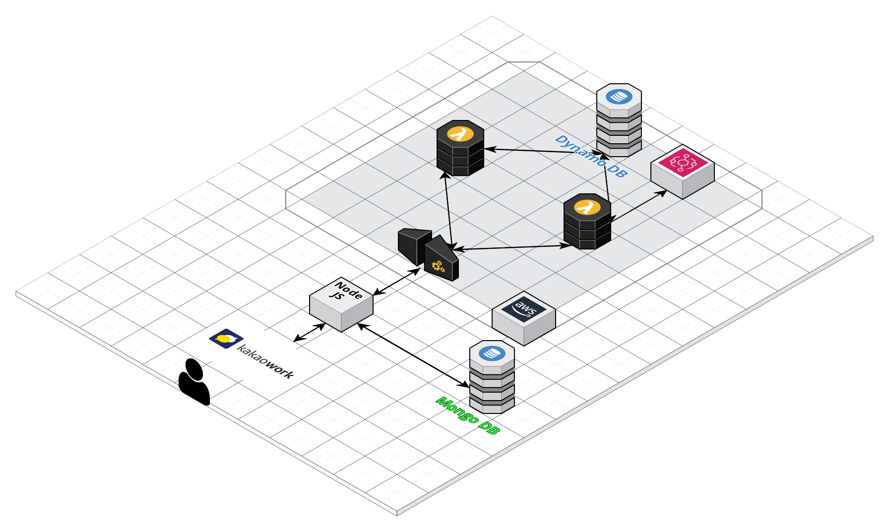

# team[-2] 응애 나 애기 멘티

## 프로젝트 기획 이유

## 주요기능 설명
1) 멘토링 키워드 알림
  + 키워드를 등록해두고, 이와 관련된 멘토링이 개설되면 멘토링 정보와 신청 버튼이 포함된 메시지 발송
  + 키워드 등록은 메시지의 모달로 전달
  (직접 구동한 사진)
2) 멘토링 신청 및 취소
  + 소프트웨어 마에스트로 ID & PW를 등록하고 1)의 기능으로 전달된 멘토링을 신청후 결과를 메시지로 발송
  + 이 기능을 통해 신청한 멘토링을 다시 취소하는 것 역시 가능
  + 계정 정보는 user_id로 매핑하여 연계된 DB에 저장됨
  + (멘토링을 신청하고 실제로 신청된 사진)
3) 멘토링 일정 관리
  + 신청한 멘토링은 연계된 DB에 저장되며 이를 기반으로 일정 표시
4) 멘토링 후기 및 한줄평
  + 멘토링별 수강자 목록을 스크래핑하여 멘토링 한줄평 요청 메시지 발송
  + 모달을 통해 DB에 업로드하여 저장
  + 위 내용을 기반으로 멘토와 멘토링에 대한 한줄평 열람 가능
  +(구동 예시)

## 아키텍쳐 구조

------------

## 팀원 목록
+ 임동진(팀장)
+ 이원기
+ 이선노
+ 함초롬 
+ 김호준
+ 유한길(문서화)
## 건의 사항 및 버그 리포팅 하러 가기
https://forms.gle/6NiahMw3tf8WfK2i7

